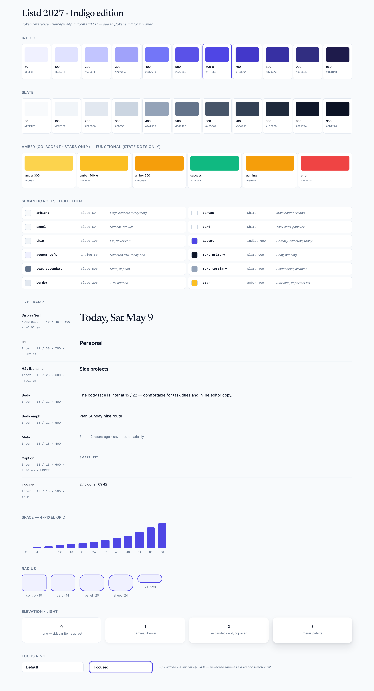

# 02 · Tokens

All numerical foundations of the system. **Do not consume raw token
values in widget code.** Wrap everything in semantic roles
(`onSurface`, `accent`, `accentSoft`, `elevationCard`, …). Raw values
exist only inside `lib/theme/app_colors.dart` and the new
`lib/theme/app_motion.dart`.

---

## Color

### Method

The palette is built in **OKLCH** so light and dark are derived from
the same hue/chroma curves rather than eyeballed. This means:

- All accents at the same lightness step have the same perceived
  weight (an indigo-500 and an emerald-500 read as equally "loud").
- Dark-mode tokens are **not** the inverse of light-mode tokens —
  they are derived from the same curve at darker lightness with
  reduced chroma, which keeps them perceptually consistent without
  becoming muddy.

OKLCH was chosen over HCL/CIELAB because it is supported natively in
modern CSS (`oklch()`) and because Flutter's `Color` constructor can
consume the resolved RGB equivalents directly. We ship both in the
table below.

### Indigo (primary brand + selection)

| Step | OKLCH | sRGB |
| --- | --- | --- |
| 50  | `oklch(0.97 0.020 268)` | `#F0F1FF` |
| 100 | `oklch(0.94 0.040 268)` | `#E0E2FF` |
| 200 | `oklch(0.87 0.090 268)` | `#C2C5FF` |
| 300 | `oklch(0.78 0.130 268)` | `#A0A2FA` |
| 400 | `oklch(0.66 0.180 268)` | `#7376F8` |
| **500** | `oklch(0.56 0.200 268)` | `#5A52E8` |
| **600** | `oklch(0.48 0.200 268)` | `#4F46E5` |
| 700 | `oklch(0.41 0.180 268)` | `#4338CA` |
| 800 | `oklch(0.34 0.150 268)` | `#3730A3` |
| 900 | `oklch(0.27 0.120 268)` | `#312E81` |
| 950 | `oklch(0.20 0.090 268)` | `#1E1B4B` |

### Slate (neutrals — cool, lightly indigo-tinted)

| Step | OKLCH | sRGB |
| --- | --- | --- |
| 50  | `oklch(0.985 0.005 250)` | `#F8FAFC` |
| 100 | `oklch(0.965 0.008 250)` | `#F1F5F9` |
| 200 | `oklch(0.930 0.012 250)` | `#E2E8F0` |
| 300 | `oklch(0.870 0.015 250)` | `#CBD5E1` |
| 400 | `oklch(0.700 0.018 250)` | `#94A3B8` |
| 500 | `oklch(0.560 0.022 250)` | `#64748B` |
| 600 | `oklch(0.450 0.026 250)` | `#475569` |
| 700 | `oklch(0.360 0.028 250)` | `#334155` |
| 800 | `oklch(0.270 0.030 250)` | `#1E293B` |
| 900 | `oklch(0.180 0.030 250)` | `#0F172A` |
| 950 | `oklch(0.130 0.026 250)` | `#0B1224` |

### Amber (single co-accent — stars, importance state)

| Step | OKLCH | sRGB |
| --- | --- | --- |
| 300 | `oklch(0.83 0.140 75)` | `#FCD34D` |
| 400 | `oklch(0.78 0.160 75)` | `#FBBF24` |
| 500 | `oklch(0.71 0.170 75)` | `#F59E0B` |

Amber appears **only** on starred tasks and the "Important" smart-list
icon. Nowhere else.

### Functional (state-pill dots only — 6 px)

| Token | Light | Dark |
| --- | --- | --- |
| success | emerald-500 `#10B981` | emerald-400 `#34D399` |
| warning | amber-500 `#F59E0B` | amber-400 `#FBBF24` |
| error | red-500 `#EF4444` | red-400 `#F87171` |

Same scoping rule as 2027: these never appear on type, surfaces, or
selection. Only on 6 px pill dots and one-line error helpers.

### Semantic roles — light theme

| Role | Value | Uses |
| --- | --- | --- |
| `ambient` | slate-50 `#F8FAFC` | App background behind everything |
| `canvas` | white `#FFFFFF` | Main content "island" |
| `panel` | slate-50 `#F8FAFC` | Sidebar, settings drawer |
| `card` | white `#FFFFFF` | Task card, popover |
| `chip` | slate-100 `#F1F5F9` | Tag pill, count chip, hover row |
| `text-primary` | slate-900 `#0F172A` | Headings, body |
| `text-secondary` | slate-500 `#64748B` | Meta, captions |
| `text-tertiary` | slate-400 `#94A3B8` | Placeholder, disabled |
| `text-on-accent` | white `#FFFFFF` | Text on indigo-600 fill |
| `border` | slate-200 `#E2E8F0` | 1 px hairlines |
| `border-strong` | slate-300 `#CBD5E1` | Hover, focus-prep |
| `divider` | slate-100 `#F1F5F9` | List separators |
| `accent` | indigo-600 `#4F46E5` | Primary action, selection ring, today |
| `accent-strong` | indigo-700 `#4338CA` | Hover/pressed accent |
| `accent-soft` | indigo-50 `#F0F1FF` | Selected row fill, today cell |
| `accent-fg` | white `#FFFFFF` | Text on accent fill |
| `focus-ring` | indigo-500 `#5A52E8` @ 2 px | 2 px outline + 4 px halo |
| `star` | amber-400 `#FBBF24` | Star icon fill, "Important" icon |
| `overlay-scrim` | slate-900 `#0F172A` @ 40% | Behind settings drawer |

### Semantic roles — dark theme

| Role | Value | Uses |
| --- | --- | --- |
| `ambient` | slate-950 `#0B1224` | App background behind everything |
| `canvas` | slate-900 `#0F172A` | Main content "island" |
| `panel` | slate-900 `#0F172A` | Sidebar, settings drawer |
| `card` | slate-800 `#1E293B` | Task card, popover |
| `chip` | slate-700 `#334155` | Tag pill, count chip, hover row |
| `text-primary` | slate-50 `#F8FAFC` | Headings, body |
| `text-secondary` | slate-400 `#94A3B8` | Meta, captions |
| `text-tertiary` | slate-500 `#64748B` | Placeholder, disabled |
| `text-on-accent` | indigo-950 `#1E1B4B` | Text on indigo-400 fill |
| `border` | slate-700 `#334155` | 1 px hairlines |
| `border-strong` | slate-600 `#475569` | Hover, focus-prep |
| `divider` | slate-800 `#1E293B` | List separators |
| `accent` | indigo-400 `#7376F8` | Primary action, selection ring, today |
| `accent-strong` | indigo-300 `#A0A2FA` | Hover/pressed accent |
| `accent-soft` | indigo-900 `#312E81` @ 40% | Selected row fill, today cell |
| `accent-fg` | indigo-950 `#1E1B4B` | Text on accent fill |
| `focus-ring` | indigo-400 `#7376F8` @ 2 px | 2 px outline + 4 px halo |
| `star` | amber-300 `#FCD34D` | Star icon fill |
| `overlay-scrim` | black `#000000` @ 60% | Behind settings drawer |

### Contrast targets

| Pair | Ratio |
| --- | --- |
| `text-primary` on `canvas` | **15.0 :1** light / **16.4 :1** dark |
| `text-secondary` on `canvas` | **5.6 :1** light / **5.0 :1** dark |
| `text-on-accent` on `accent` | **8.6 :1** light / **8.1 :1** dark |
| `accent` on `canvas` | **5.4 :1** light / **5.1 :1** dark |

All meet WCAG **AA for normal text** (4.5 :1) and our targets exceed
this where readable type sits on accent fills.

---

## Type

### Faces

- **Inter Variable** — primary UI face. Use optical sizing
  (`fontVariations: [FontVariation('opsz', size)]`). Tabular numerals
  on counts and dates (`FontFeature.tabularFigures()`).
- **Newsreader** — exactly three placements: the Today date headline,
  empty-state declarative lines, and the About dialog quote.

### Ramp

| Role | Family | Size | Line | Weight | Tracking | Notes |
| --- | --- | --- | --- | --- | --- | --- |
| Display Serif | Newsreader | 40 | 48 | 500 | -0.02 em | Today, empty states |
| Display Inter | Inter | 32 | 40 | 700 | -0.02 em | Settings hero, About |
| H1 | Inter | 22 | 30 | 700 | -0.02 em | Page titles (was 24) |
| H2 | Inter | 18 | 26 | 600 | -0.01 em | Section heads, list name |
| Body | Inter | 15 | 22 | 400 | 0 | Default |
| Body emph | Inter | 15 | 22 | 500 | 0 | Task title, button |
| Meta | Inter | 13 | 18 | 400 | 0 | Edited time, dates |
| Caption | Inter | 11 | 16 | 600 | 0.06 em | All-caps section labels |
| Tabular | Inter | 13 | 18 | 500 | 0 | Counts, due times — `tabular-nums` |

### Why H1 dropped from 24 → 22

The current 24 px H1 forces user-named lists like "1" or "lists" to
shout. 22 px keeps headings clearly higher-rank than body (15 px) but
prevents single-character user content from becoming a billboard.

### Italic

Italic Inter is reserved for **negation** — empty-state copy, "no
date set" placeholders, "(deleted)" markers in undo toasts. It is
never used for emphasis in body text.

---

## Space

### Grid

4 px base. Allowed steps: **2, 4, 8, 12, 16, 20, 24, 32, 40, 48, 64, 80, 96**.

The `2` step is permitted only for icon-to-icon micro-spacing inside
controls (e.g. caret + label inside a chip). Every other use must be
≥ 4 px.

### Density modes

| Token | Cozy (default) | Compact |
| --- | --- | --- |
| `row-height-task` | 56 | 44 |
| `row-height-nav` | 36 | 32 |
| `control-height` | 36 | 32 |
| `gap-list` | 12 | 8 |
| `gap-card-sections` | 16 | 12 |
| `padding-canvas-x` | 32 | 24 |
| `padding-canvas-y` | 24 | 16 |

Density is a per-user setting (already partially shipped in PR #23).
The toggle lives in Settings → Appearance, not in the sidebar.

### Layout grid

- Sidebar (drawer mode, desktop): **240 px**, fixed
- Sidebar (rail mode, desktop, post-MVP): **64 px**
- Top bar: **40 px**
- Content max-width: **920 px** (centers in canvas)
- Page side gutters: **32 px** cozy / **24 px** compact

---

## Radius

| Token | Value | Use |
| --- | --- | --- |
| `radius-control` | 10 px | Buttons, inputs, chips with corners |
| `radius-card` | 14 px | Task card, popover (was 16) |
| `radius-panel` | 20 px | Canvas, settings drawer |
| `radius-sheet` | 24 px | Capture sheet, mobile bottom sheets |
| `radius-pill` | 999 px | Chips, count badges, sync pill |

Card radius drops from 16 → 14 because the new tighter density makes
16 read as too "soft" against the stricter type ramp. Panel stays at
20 — that's the canvas island radius, which has earned its calm.

---

## Elevation

Depth is communicated through **content layering** + **soft shadow**
in light, and **edge-highlight + soft shadow** in dark (because shadow
disappears on near-black surfaces).

### Light theme shadows

| Level | Shadow | Use |
| --- | --- | --- |
| 0 | none | Ambient page, sidebar items at rest |
| 1 | `0 1px 2px rgba(15,23,42,0.04), 0 4px 12px rgba(15,23,42,0.04)` | Canvas island, sidebar drawer |
| 2 | `0 2px 4px rgba(15,23,42,0.06), 0 8px 24px rgba(15,23,42,0.06)` | Expanded task card, popover |
| 3 | `0 4px 8px rgba(15,23,42,0.08), 0 16px 32px rgba(15,23,42,0.10)` | Context menu, command palette |
| 4 | `0 8px 16px rgba(15,23,42,0.12), 0 24px 48px rgba(15,23,42,0.14)` | Settings drawer, capture sheet |

### Dark theme shadows + edge highlight

| Level | Shadow | Top edge | Use |
| --- | --- | --- | --- |
| 0 | none | none | Ambient |
| 1 | `0 1px 2px rgba(0,0,0,0.40)` | `1px solid rgba(255,255,255,0.04)` | Canvas |
| 2 | `0 2px 8px rgba(0,0,0,0.50)` | `1px solid rgba(255,255,255,0.06)` | Card, popover |
| 3 | `0 4px 16px rgba(0,0,0,0.60)` | `1px solid rgba(255,255,255,0.08)` | Menu, palette |
| 4 | `0 8px 32px rgba(0,0,0,0.70)` | `1px solid rgba(255,255,255,0.10)` | Drawer, sheet |

The 1 px top-edge highlight is critical in dark mode — without it,
elevated surfaces visually dissolve into the canvas.

---

## Focus

Focus ring is **never** the same color as a hover or selection fill —
it is always a 2 px outline + 4 px translucent halo. The user must
always be able to tell, even on a touch screen with no hover, which
element has keyboard focus.

| State | Visual |
| --- | --- |
| Focus | `2 px solid accent` outline, offset 2 px, + `4 px accent @ 24%` halo |
| Hover | `1 px border-strong`, fill = `chip` (slate-100 / slate-700) |
| Pressed | hover state + `accent` text color, no fill change |
| Selected (sidebar/list row) | `accent-soft` fill, `accent` text, no outline |
| Disabled | `text-tertiary` text, no border, opacity 0.6 on icons |

`overflow: visible` is required on focus-ringed widgets so the halo
isn't clipped by a parent.

---

## Motion (summary — see `04_motion.md` for full spec)

Single canonical spring with three named calibrations:

| Token | k | c | m | Settles | Use |
| --- | --- | --- | --- | --- | --- |
| `motion.settle` | 280 | 28 | 1.0 | ~220 ms | Default state changes (current 2027 spring) |
| `motion.flick` | 380 | 30 | 1.0 | ~160 ms | Tap → flip (button press, chip toggle) |
| `motion.breathe` | 180 | 24 | 1.0 | ~320 ms | Sheet/drawer enter, settings open |

Easing for non-spring (rare): `cubic-bezier(0.32, 0.72, 0.0, 1.0)`.

Reduced motion → all = `Duration.zero`.
