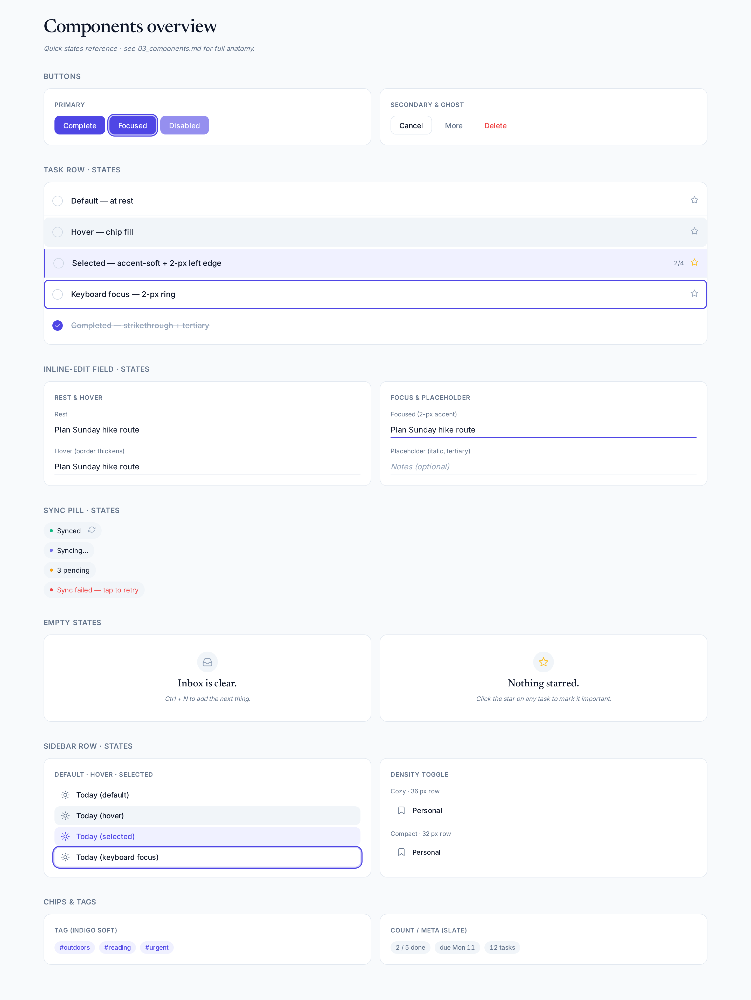
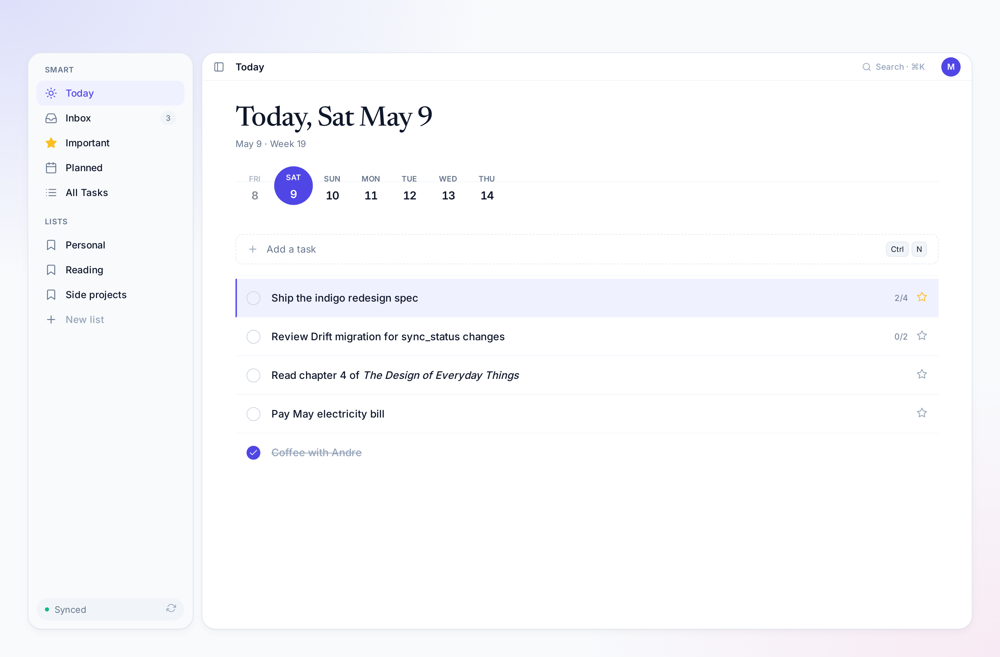
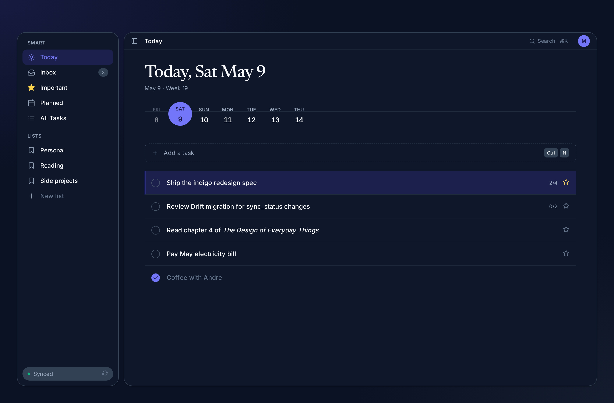
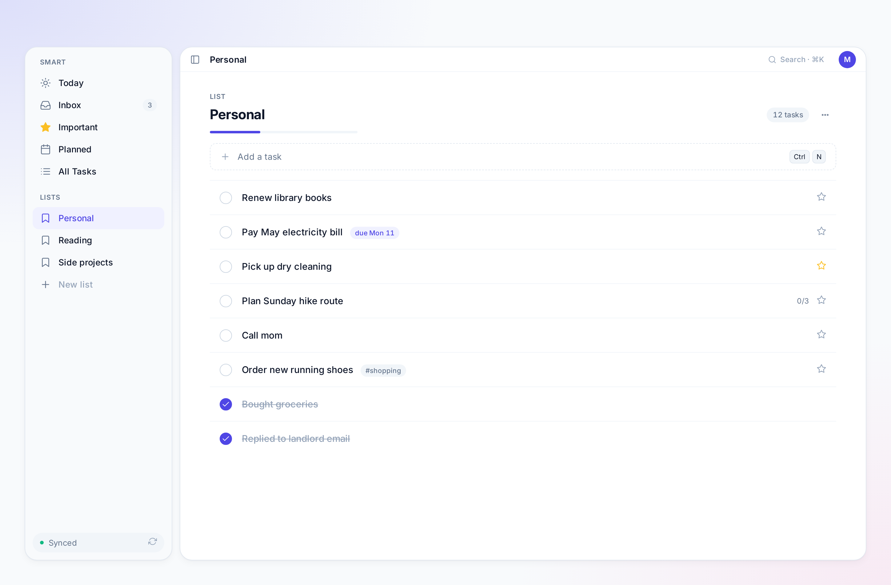
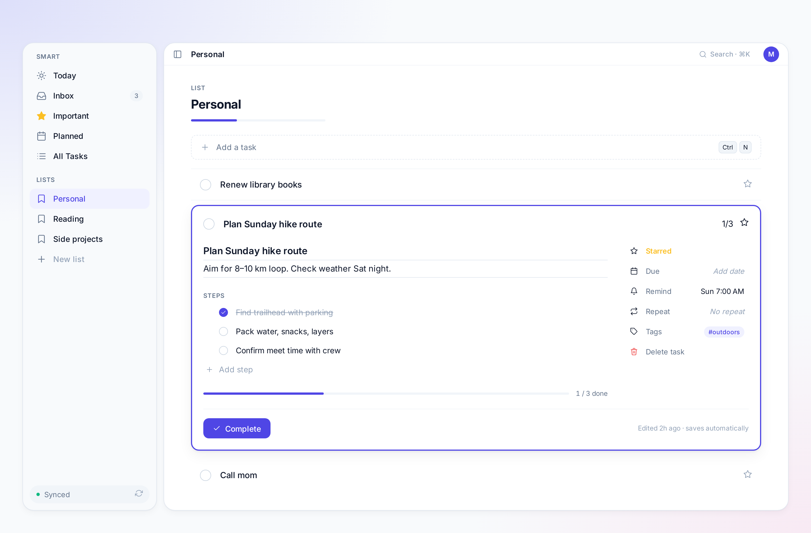
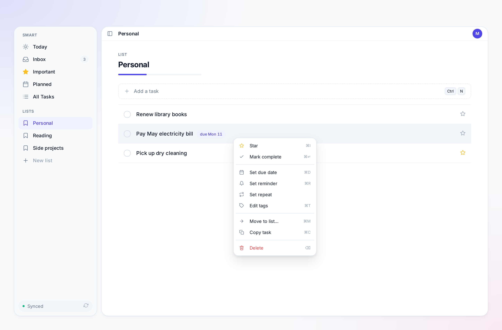
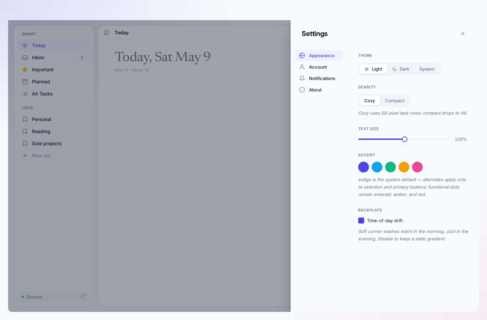
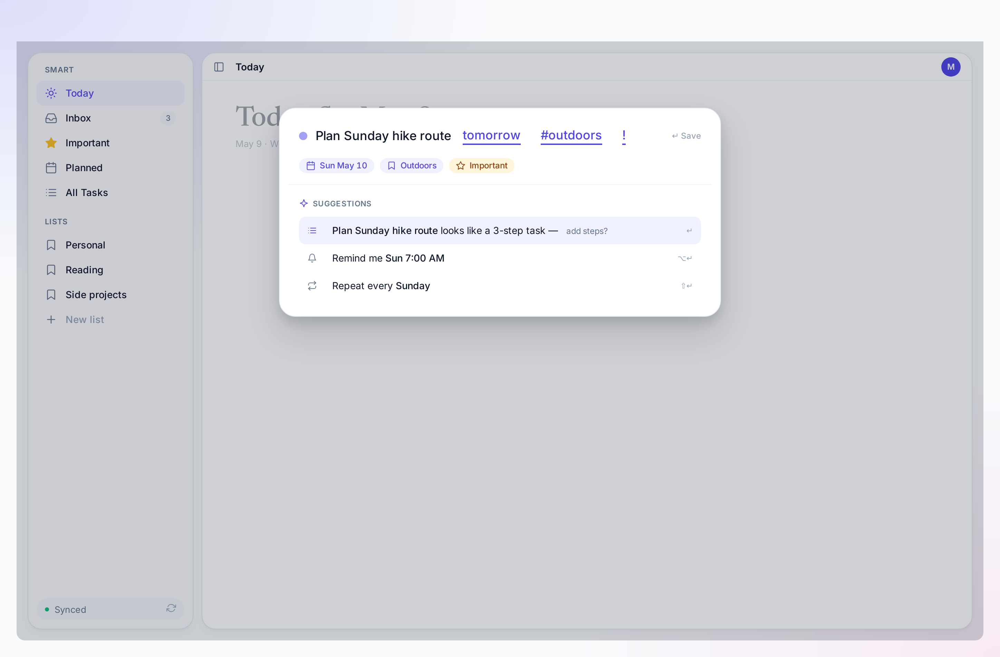
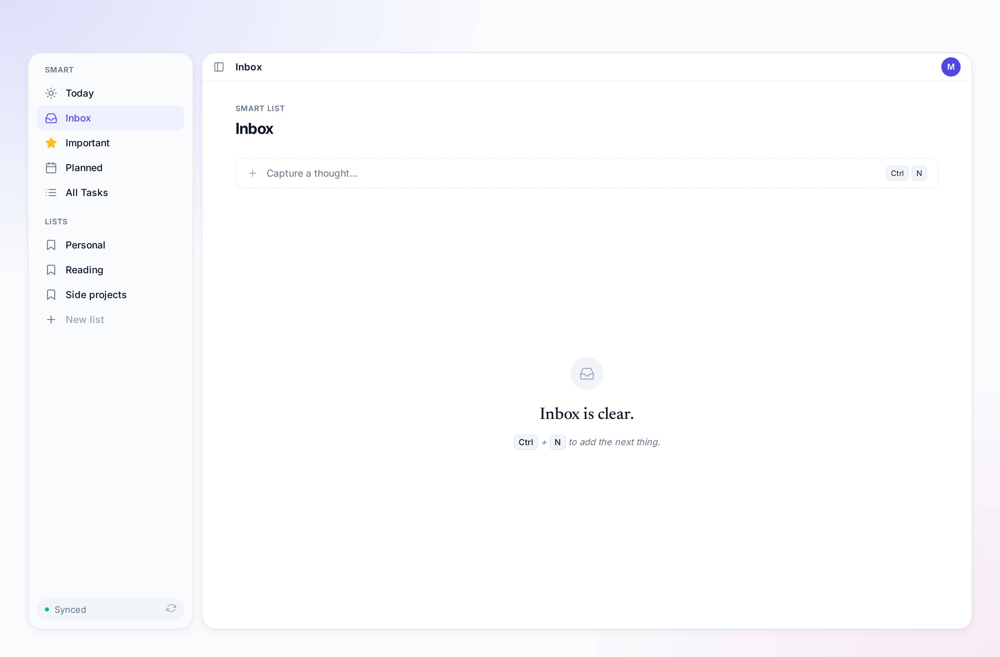

# 03 · Components

Per-component redesign specs. Each section covers: anatomy, states,
metrics, motion, accessibility, and a delta from the current
implementation.



---

## 1. App shell

The shell composes: ambient backplate + sidebar drawer + top bar +
canvas island. The canvas is the only surface that hosts content.

### Anatomy

```
┌─────────────────────────────────────────────────────────────┐
│ ambient backplate                                           │
│ ┌──────────┐ ┌────────────────────────────────────────────┐ │
│ │ sidebar  │ │ ◉ Today                            [avatar] │ │  ← top bar 40 px
│ │ (240 px) │ ├────────────────────────────────────────────┤ │
│ │          │ │                                            │ │
│ │ SMART    │ │  canvas island (white / slate-900)         │ │
│ │ • Today  │ │  radius 20 px, elevation 1                 │ │
│ │ • Inbox  │ │                                            │ │
│ │  …       │ │                                            │ │
│ │          │ │                                            │ │
│ │ LISTS    │ │                                            │ │
│ │  …       │ │                                            │ │
│ │          │ │                                            │ │
│ │ ⏺ Synced │ │                                            │ │  ← single sync pill
│ └──────────┘ └────────────────────────────────────────────┘ │
└─────────────────────────────────────────────────────────────┘
```

### Metrics

| Item | Value |
| --- | --- |
| Outer page padding | 16 px (cozy) / 12 px (compact) |
| Sidebar–canvas gap | 12 px |
| Sidebar width | 240 px (drawer) / 64 px (rail, post-MVP) |
| Top bar height | 40 px |
| Canvas radius | 20 px |
| Canvas elevation | 1 |
| Backplate | radial gradient, time-of-day shifted (kept from 2027) |

### Delta from current

- Two sync pills → **one** (sidebar bottom)
- "Listd" account block at sidebar top → **removed**
- Sidebar `Sign out` button → **removed** (moved to Settings → Account)
- Top-bar workspace pill `[crest] Listd` → replaced with active page title

---

## 2. Top bar

### Anatomy

```
[ ⊟ ]  Today                                  [⏺ live]  [ M ]
sidebar  page title                            avatar
toggle    H2 inter 18                           28×28
```

### States

- **Default.** Page title only. Avatar opens a popover with: name, email, settings link, sign out.
- **Editing list name.** Page title becomes an inline `TextField` with an indigo focus ring. Esc cancels, Enter commits.
- **Offline.** A 6-px slate-400 dot prefixes the title with `aria-label="offline"`.
- **Sync error.** A 6-px red-500 dot with a tooltip `tap to retry`.

### Why the title moved here

Currently the page title is duplicated: small in the top bar, then huge
inside the canvas island. We **promote** the canvas H1 to the top bar
(at 18 px, H2-weight) and **delete** the in-canvas duplicate, except for
the Today screen which keeps its Newsreader headline because it's the
emotional anchor of the whole app.

---

## 3. Sidebar drawer

### Anatomy

```
SMART            ← caption, slate-500
☼ Today          ← row, height 36, gap 12
☐ Inbox
★ Important
▦ Planned
≡ All Tasks

LISTS
▱ Personal      ← user-named list, bookmark-icon, slate-500
▱ Reading
▱ Side projects
+ New list      ← appears at bottom of the list group, on hover

────────────────  ← divider

⏺ Synced  ⟳     ← sync pill, single source of truth
```

### Row states

| State | Visual |
| --- | --- |
| Default | 36 px tall, 12 px left gutter, slate-500 icon, slate-700 label |
| Hover | `chip` fill, slate-900 label, slate-700 icon |
| Selected | `accent-soft` fill, indigo-600 label, indigo-600 icon |
| Focus | 2 px indigo-600 outline + 4 px halo |
| Active drag-over (drop target) | 2 px dashed indigo-400 outline |

**No left rail accent.** The current implementation paints a left
flame stripe on the active row — we drop this. The fill alone reads
clearly when paired with the typography promotion to indigo-600.

### Delta from current

- Account block (avatar, name, email) → removed
- Bottom buttons `[Settings] [Sign out]` → removed
- Bottom slot becomes the sync pill, full-width
- "+ New list" inline in the lists section, hover-revealed

---

## 4. Today screen

The emotional anchor of the app. Keeps the Newsreader headline,
trades the calendar grid for a horizontal date track.





### Anatomy

```
Today, Sat May 9                          ← Newsreader 40/48
   today's date in subtle slate-500        ← "May 9 · Week 19"
   ··· · · · ●═════● · · · ···             ← horizontal date track
       Fri Sat Sun Mon Tue Wed Thu          (today is the indigo capsule)

[ + Capture something with Ctrl+N ]        ← always-present capture row

────────────────────────────────────────

  ▢ Task title               ⭐ 0/3       ← cozy task row, 56 px
  ▣ Completed task                         strikethrough secondary
```

### Date track

- Track height: **56 px** (down from 88)
- Each day cell: 32 px wide, 56 px tall
- Today: indigo-600 fill capsule, white text, day-of-week + day-of-month
- Past days: slate-400 text, no fill, tap = scope view to that day
- Future days: slate-700 text, no fill, tap = scope view to that day
- A 1 px slate-200 horizontal centerline runs through the track
- Today's capsule sits *on* the line, the others sit *off* it (above)

### Empty state

If the day has zero tasks:

```
A clear day.                ← Newsreader 24/32, slate-700
Capture something with Ctrl + N — or just enjoy it.
                            ← Inter 13/18 italic, slate-500
```

### Delta from current

- Calendar grid → date track
- "A clear day" copy retained (it's good)
- Capture row promoted from hidden Ctrl+N only → always-visible row at the top of the task list

---

## 5. List view



### Anatomy

```
LIST                              ← caption, slate-500
Personal                          ← H1 inter 22, slate-900
                                    progress bar 4 px (if any complete)

[ + Add a task ]                  ← capture row, slate-100 dashed border

  ▢ besok                ⭐ 0/1   ← task row 56 px cozy
  ▢ Read chapter 4               
  ▣ Bought groceries              strikethrough, slate-400
```

### Header

- Caption above name (`LIST` for user lists, `SMART` for Today/Inbox/etc)
- Name H1 22 px, max 32 chars, ellipsis after
- Progress bar appears only if at least one task is completed
- Track: `border` slate-200; fill: `accent` indigo-600
- "Refresh" icon button moved into a `…` overflow menu in the row's right edge

### Task row (collapsed) — the heart of the app

```
[checkbox]  Title                          [count] [star]
  16        15/22 inter 500                 12      16

cozy: row 56 px, padding 16 horizontal, 16 vertical
compact: row 44 px, padding 12 horizontal, 10 vertical
```

#### Visual rules

- 1 px `divider` slate-100 between rows
- Hover: `chip` slate-100 fill on the row, no border
- Selected (keyboard navigation): `accent-soft` indigo-50 fill, 2 px indigo-600 left edge
- Completed: checkbox is filled indigo-600, title is `text-tertiary` strikethrough, star (if present) becomes amber-300

### Task row (expanded) — inline editor

The card lifts to elevation 2 with a 2 px indigo-600 outline ring at
the same radius. The card's height grows from 56 → between 200 and
400 px depending on content.

```
┌─ outline 2 px indigo-600 ─────────────────────────────────┐
│ ◯ Title                                       0/1   ⭐    │
│                                                          │
│ Task title                                  ⭐ Starred   │
│ ─────────────────────────────────────────   📅 Due       │
│ Notes (optional, italic placeholder)        🔔 Remind    │
│                                              ⟳ Repeat    │
│ STEPS                                        🏷 Tags     │
│  ▢ Subtask 1                                             │
│  ▢ Subtask 2                                             │
│  + Add step                                              │
│                                                          │
│ ▰▰▰▰▰▰░░░░  2/5 done                                     │
│                                                          │
│ [ ✓ Complete ]                  edited 2h ago    🗑      │
└──────────────────────────────────────────────────────────┘
```

#### Behavior

- One click on row → expand. One click on title → expand and focus title field.
- Esc → collapse. Shift+Tab from first field → collapse.
- Title and Notes use the `inline-edit` field treatment (see §6).
- Steps are reorderable via drag handle (left, hover-only).
- Progress bar appears only if there are 2+ steps.
- "Delete" is at the bottom right, slate-500 icon → red-500 on hover.

### Delta from current

- Step text fields gain hairline-rest / 2-px-focus underline (not always-on underline)
- Progress bar added between steps and the Complete button
- "Complete" pill button changes from flame-soft fill to `accent` indigo-600 fill, white text
- "Edited 2h ago" demoted to slate-500 caption, not body

---

## 6. Inline-editable field



Single component that powers task title, notes, list name, step text.

### States

| State | Visual |
| --- | --- |
| Rest | text only, 1 px slate-200 hairline underneath |
| Hover | underline thickens to slate-400 |
| Focus | underline becomes 2 px indigo-600, no fill change |
| Filled placeholder | italic slate-400 |
| Read-only | no underline ever |

The hairline at rest is what currently goes missing in screenshots 3
and 4 — users can't tell what's editable until they click. The
hairline solves discoverability without modal state.

---

## 7. Context menu



(Already shipped in PR #22 — keep it. These are the visual updates.)

### Anatomy

```
┌────────────────────────────┐
│ ⤺ Reopen                   │  destructive groups: amber/red text
│ ⭐ Star                     │  primary actions: slate-700 text, slate-500 icon
├────────────────────────────┤
│ 📅 Set due date            │
│ 🔔 Set reminder            │
│ ⟳ Set repeat               │
│ 🏷 Edit tags                │
├────────────────────────────┤
│ ↔ Move to list…            │
│ 🗐 Copy task                │
├────────────────────────────┤
│ 🗑 Delete                   │  red-500 text + icon
└────────────────────────────┘

elevation 3, radius 14, background `card`, 1 px `border` outline
```

### Behavior

- Right-click anywhere on a task row → menu opens at cursor
- Long-press (Android) → opens at center, becomes bottom sheet
- Esc closes
- Hover lights item with `chip` fill, accent stays slate-500 except for Delete which goes red-500
- Item heights: 32 px (cozy) / 28 px (compact)

### Delta from current

- Drop the warm-cream fill behind the menu → use opaque card
- Tighten item height from 36 → 32
- Strengthen separator from `divider` slate-100 to `border` slate-200 (the menu surface needs sharper grouping than the canvas)

---

## 8. Settings — side drawer



The biggest visual change in the redesign.

### Anatomy

```
                         ┌──────────────────────────────────┐
                         │ Settings                       ✕ │
                         ├──────────────────────────────────┤
                         │                                  │
                         │ ◉ Appearance                     │  ← three nav rows
                         │ ◉ Account                        │
                         │ ◉ Notifications                  │
                         │ ◉ About                          │
                         │ ──────────────────────────────── │
                         │                                  │
                         │ THEME                            │
                         │ [Light] [Dark] [System]          │
                         │                                  │
                         │ DENSITY                          │
                         │ [Cozy] [Compact]                 │
                         │                                  │
                         │ TEXT SIZE                        │
                         │ ●────────────── 100%             │
                         │                                  │
                         └──────────────────────────────────┘
                            560 px wide, full canvas height
```

### Behavior

- Slides in from right edge, `motion.breathe` (320 ms)
- Backplate dims to `overlay-scrim` (slate-900 @ 40%)
- Esc / click-on-scrim / X-button close
- Auto-saves on every change (no Save button anywhere)
- Density toggle is shown here, not in the sidebar

### Delta from current

- Centered modal + BackdropFilter blur → opaque side drawer, no blur
- Settings becomes 4 panes (was 3): Appearance / Account / Notifications / **About**
- Sign out lives in Account pane, behind a confirmation dialog

---

## 9. Capture sheet (Ctrl+N)



Already shipped per CLAUDE.md. These are the visual updates.

### Anatomy

```
┌────────────────────────────────────────────────────────┐
│ ▒ Type to add a task…                              ⏎  │  ← single field
│                                                       │
│  Suggestions:                                         │  ← AI slot, hidden by default
│   ◯ "tomorrow" → due tomorrow                         │
│   ◯ "#reading" → list: Reading                        │
│   ◯ "!" → starred                                     │
└────────────────────────────────────────────────────────┘
   560 px wide, sits 80 px below the top of canvas
   elevation 4, radius 24
```

### Behavior

- Slides down from top, `motion.breathe`
- Field auto-focuses
- As the user types, parsed tokens (dates, lists, hashtags, `!`) light
  up in the field with indigo underline + small inline chip preview
- AI suggestion slot is hidden by default; appears once the user types
  4+ chars; suggestions are keyboard-navigable

### Why we reserve the AI slot now

Per NOVA principle 4, productivity surfaces in 2027 are co-created
with models. Listd does not need to ship AI suggestions today, but the
**spatial reservation** must be in place — otherwise we will redesign
this surface in 6 months. The slot is invisible until used.

---

## 10. Command palette (Ctrl+K)

Already shipped per CLAUDE.md. Visual updates only.

- Width: **640 px** (was 560)
- Field: 44 px tall, no border, indigo-600 cursor
- Result rows: 36 px tall, icon + label + hint
- Hint shows the keyboard shortcut to invoke the action directly
  (e.g. `Ctrl+I` on the right of "Mark important")
- Group separators: caption + 1 px slate-200 divider

---

## 11. Sync status pill

Single instance, sidebar bottom-left.

### States

| State | Visual |
| --- | --- |
| Synced | 6 px emerald-500 dot · "Synced" · ⟳ icon |
| Syncing | 6 px indigo-500 dot pulse · "Syncing…" · ⟳ icon spinning |
| N pending | 6 px amber-500 dot · "3 pending" · ⟳ icon |
| Failed | 6 px red-500 dot · "Sync failed" · ↻ retry |

### Delta from current

- Pill moves from two locations → one
- Dot stays at 6 px (current spec is correct)
- The pill is clickable everywhere — clicking pushes a `requestSync()` call
- A long-press / right-click on the pill opens a small popover with last-sync timestamp, pending count detail, and a "Force pull" link

---

## 12. Empty states



Every smart list and user list gets the same empty-state component:

```
            ▢                       ← icon, 24 px slate-300 phosphor

   Inbox is clear.                  ← Newsreader 24/32 slate-700

   Ctrl + N to add the next thing.  ← Inter 13/18 italic slate-500
```

Variants per surface:

| Surface | Headline | Body |
| --- | --- | --- |
| Today | "A clear day." | "Capture something with `Ctrl + N` — or just enjoy it." |
| Inbox | "Inbox is clear." | "`Ctrl + N` to add the next thing." |
| Important | "Nothing starred." | "Click the star on any task to mark it important." |
| Planned | "Nothing planned." | "Set a due date on any task to see it here." |
| All Tasks | "No tasks yet." | "`Ctrl + N` to add the first one." |
| User list | "*{list name}* is empty." | "`Ctrl + N` and prefix with `#{list-name}` to add to this list." |

Each empty state takes the canvas-island vertical center.
